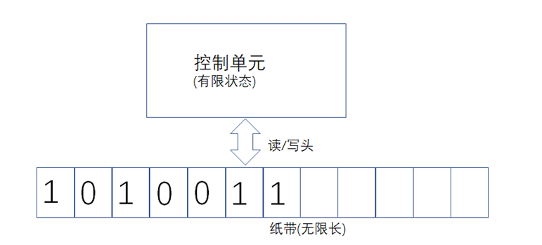
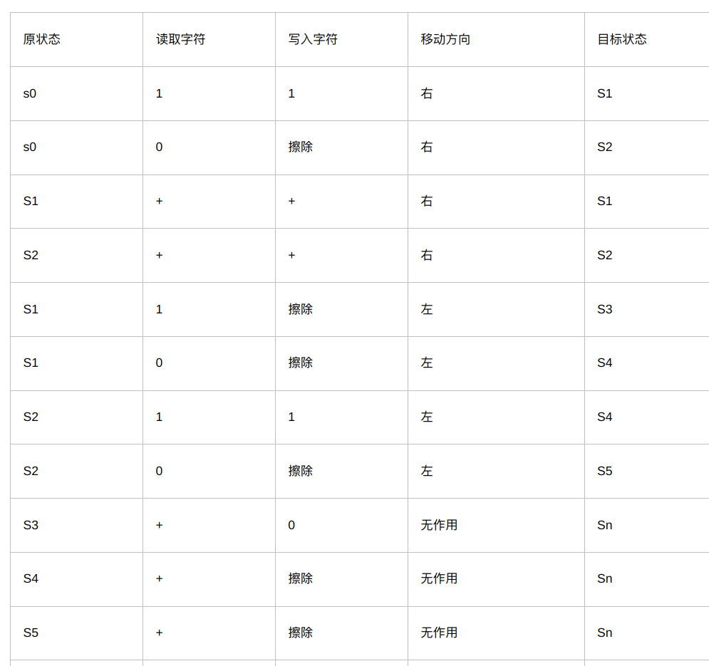
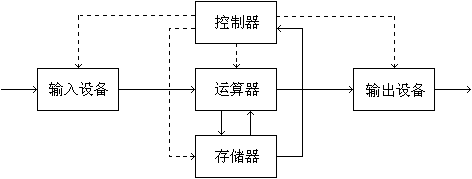
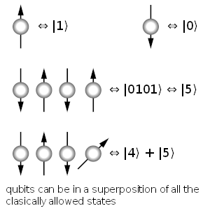
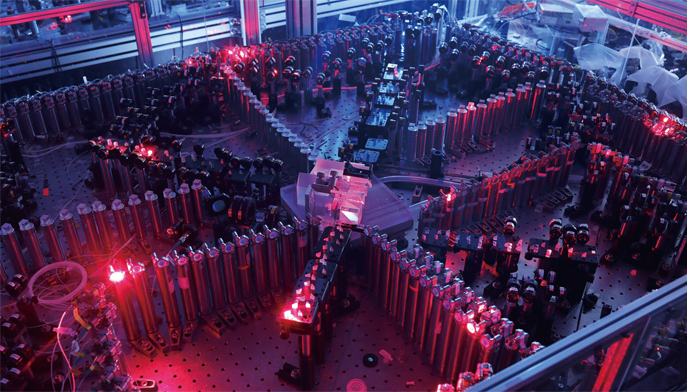
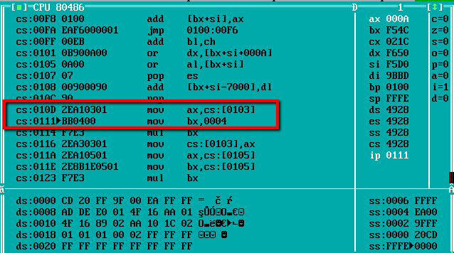
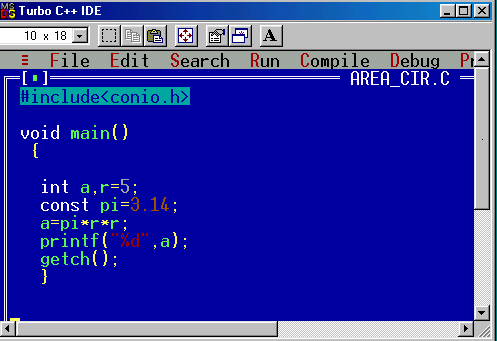
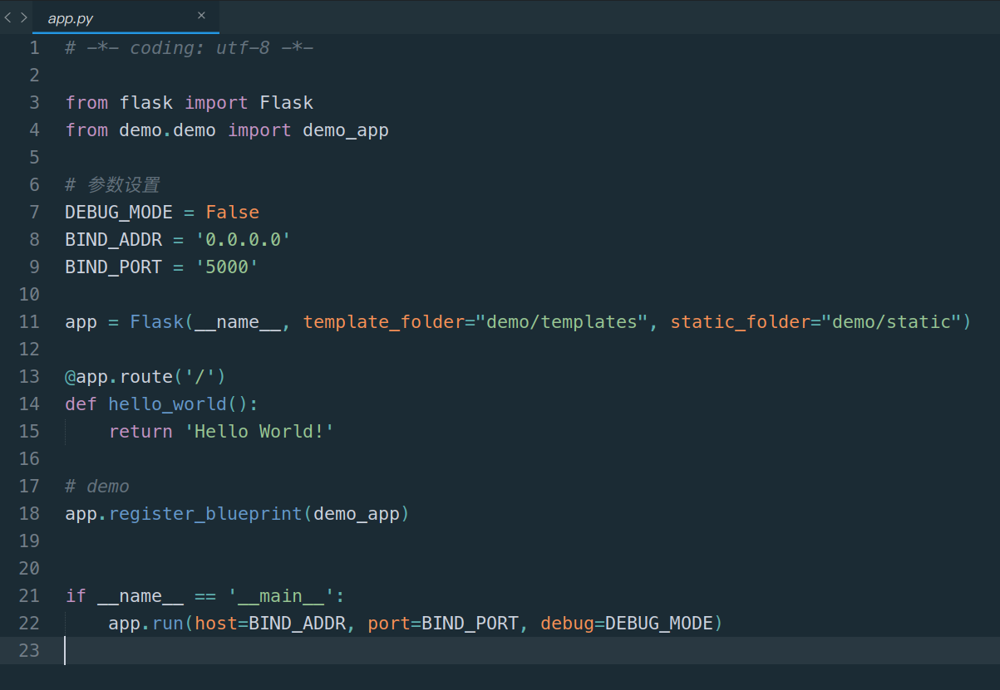

## 开场

### 1. 学编程的目的

#### 现代科研的工具

- 数学
- 英语
- 计算机

> **STEM** - Science, Technology, Engineering, and Mathematics

#### 思维方式

- 发散 vs 收敛
- 归纳 vs 演绎
- 编程思维之我见

### 2. 计算机简介

#### 分类

- 理论计算机（图灵机）

- 存储程序式计算机（冯诺伊曼计算机）

- 量子计算机

#### 操作系统

- Unix (1971)
- Windows (1985)
- Linux (1991)
- MacOS (2001), iOS (2007)
- Android (2008)

### 3. 程序设计语言简介

#### 自然语言 vs 程序设计语言

#### 程序设计语言

- 机器语言
- 汇编语言

- 中级语言

- 高级语言

#### 执行方式

- 解释执行
- 编译执行
