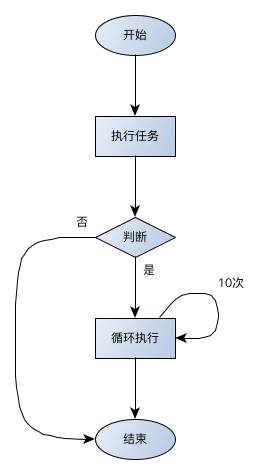

## 程序流程1


### 程序流程图




### If-then-else

```python

if 条件1:
    ...
elif 条件2:
    ...
else:
    ...

```


### 函数过程

```python

def 函数名:
    #程序内容
    ...

```


示例：

```python
# 比较三个数字，返回最大的那个
def max2(a, b, c):
    if a > b and a > c:
        return a
    elif b > a and b > c:
        return b
    else:
        return c

print(max2(1,2))

# 2
```